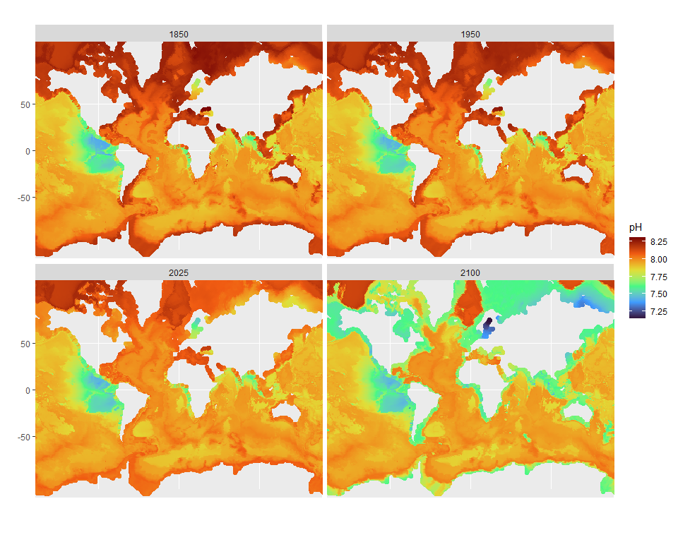

Download IPCC6 CMIP6 data
================
Chih-Lin Wei
2024-09-16

``` r
library(ncdf4)
library(abind)
library(dplyr)
library(ggplot2)
```

# Download CMIP6 data

The example seawater pH data cane be downloaded from Earth System Grid
Federation
([ESGF](https://aims2.llnl.gov/search/?project=CMIP6&resultType=originals+only&activeFacets=%7B%22variable_id%22%3A%22ph%22%2C%22cf_standard_name%22%3A%22sea_water_ph_reported_on_total_scale%22%2C%22source_id%22%3A%22NorESM2-MM%22%2C%22institution_id%22%3A%22NCC%22%2C%22experiment_id%22%3A%22ssp585%22%2C%22nominal_resolution%22%3A%22100+km%22%2C%22table_id%22%3A%22Oyr%22%2C%22frequency%22%3A%22yr%22%2C%22realm%22%3A%22ocnBgchem%22%2C%22variant_label%22%3A%22r1i1p1f1%22%2C%22grid_label%22%3A%22gr%22%7D)).
We use Norwegian Earth System Model
([NorESM2](https://gmd.copernicus.org/articles/13/6165/2020/)) outputs
from from [2021 to
2030](http://noresg.nird.sigma2.no/thredds/fileServer/esg_dataroot/cmor/CMIP6/ScenarioMIP/NCC/NorESM2-MM/ssp585/r1i1p1f1/Oyr/ph/gr/v20230616/ph_Oyr_NorESM2-MM_ssp585_r1i1p1f1_gr_2021-2030.nc)
and [2091 to
2100](http://noresg.nird.sigma2.no/thredds/fileServer/esg_dataroot/cmor/CMIP6/ScenarioMIP/NCC/NorESM2-MM/ssp585/r1i1p1f1/Oyr/ph/gr/v20230616/ph_Oyr_NorESM2-MM_ssp585_r1i1p1f1_gr_2091-2100.nc)
as examples. You may save these files in your download folder. The full
url list of yearly dataset from 2015 to 2298 is available as weget shell
script on
[ESGF](https://aims2.llnl.gov/search/?project=CMIP6&resultType=originals+only&activeFacets=%7B%22variable_id%22%3A%22ph%22%2C%22cf_standard_name%22%3A%22sea_water_ph_reported_on_total_scale%22%2C%22source_id%22%3A%22NorESM2-MM%22%2C%22institution_id%22%3A%22NCC%22%2C%22experiment_id%22%3A%22ssp585%22%2C%22nominal_resolution%22%3A%22100+km%22%2C%22table_id%22%3A%22Oyr%22%2C%22frequency%22%3A%22yr%22%2C%22realm%22%3A%22ocnBgchem%22%2C%22variant_label%22%3A%22r1i1p1f1%22%2C%22grid_label%22%3A%22gr%22%7D).

# Open CMIP6 data

The CMIP6 model projection is a 4-way array object containing x, y , z,
and t. We can see the horizontal, vertical, and temporal resolution of
the model projection.

``` r
# Seawater pH from 2021 to 2030
m1 <- nc_open("C:/Users/user/Downloads/ph_Oyr_NorESM2-MM_ssp585_r1i1p1f1_gr_2021-2030.nc") 
a1 <- ncvar_get(m1, "ph") 

# Seawater pH from 2019 to 2100
m2 <- nc_open("C:/Users/user/Downloads/ph_Oyr_NorESM2-MM_ssp585_r1i1p1f1_gr_2091-2100.nc") 
a2 <- ncvar_get(m2, "ph") 

# Dimensions of model projections
dim(a1)
#> [1] 360 385  70  10
```

The bottom most layer can be obtained by overlaying projection from
deepest to shallowest layers. Here, we made a simple function, keep_b(),
to extract the seabed data.

``` r
keep_b <- 
  function(x){
  y <- NULL
  for(j in 1:dim(x)[4]){
    b <- x[,,1,j]
    for(i in 2:dim(x)[3]){
      # Next layer
      n <- x[,,i,j]
      # Replace surface with next layer
      b[!is.na(n)] <- n[!is.na(n)]
    }
    # Combine data
    y <- abind(y, b, along=3)
  }
  return(y)
}
```

After overlaying, the 4-way array become 3-way array consisting of 10
layers (or years) of spatial grids (360 x 385).

``` r
b1 <- keep_b(a1)
b2 <- keep_b(a2)

# Dimensions of the bottom most projections
dim(b1)
#> [1] 360 385  10
```

# Convert [NorESM2](https://gmd.copernicus.org/articles/13/6165/2020/) outputs to latlon projection

``` r
# Coordinates of each grid
y <- as.vector(ncvar_get(m1, "latitude"))
x <- as.vector(ncvar_get(m1, "longitude"))
x[x>180] <- x[x>180]-360
```

# Compare seabed pH between 2021 and 2100

``` r
# 2021: first layer of b1
b2021 <- cbind(x, y, value=b1[,,1] %>% as.vector) %>% data.frame %>%　na.omit
# 2100: 10th layer of b2
b2100 <- cbind(x, y, value=b2[,,10] %>% as.vector) %>% data.frame %>%　na.omit

out <- rbind(cbind(b2021, year=2021), cbind(b2100, year=2100))
```

``` r
ggplot(data=out, aes(x=x, y=y, colour=value))+
  geom_point()+
  coord_map()+
  labs(x="", y="", colour="pH")+
  scale_colour_viridis_c(option = "turbo")+
  facet_wrap(~year)
```

<!-- -->
