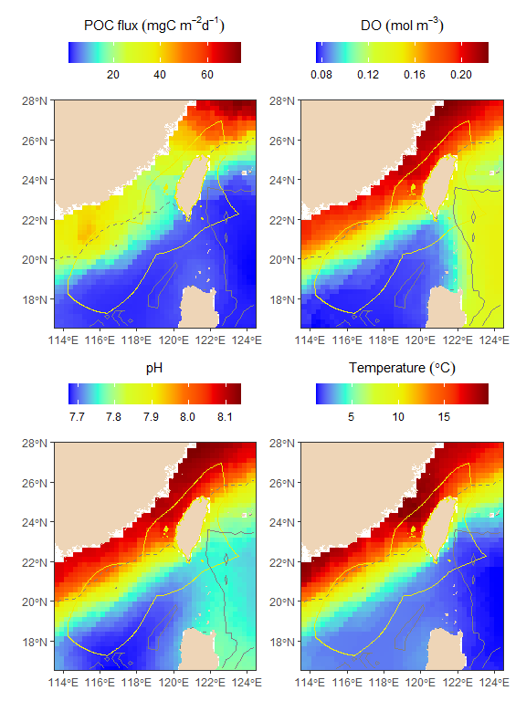
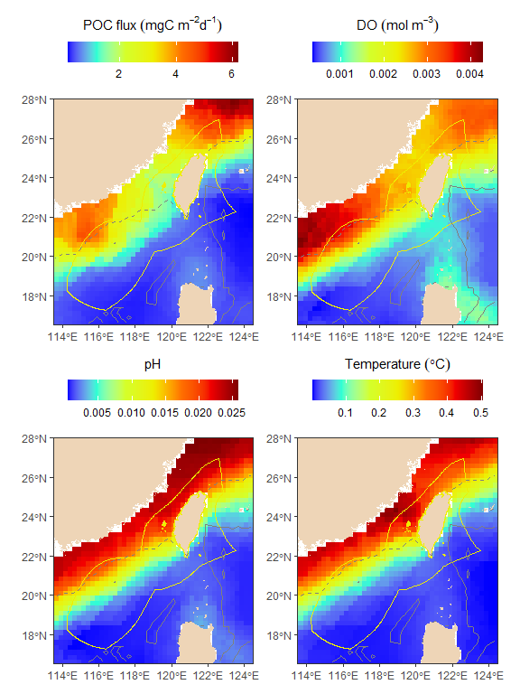
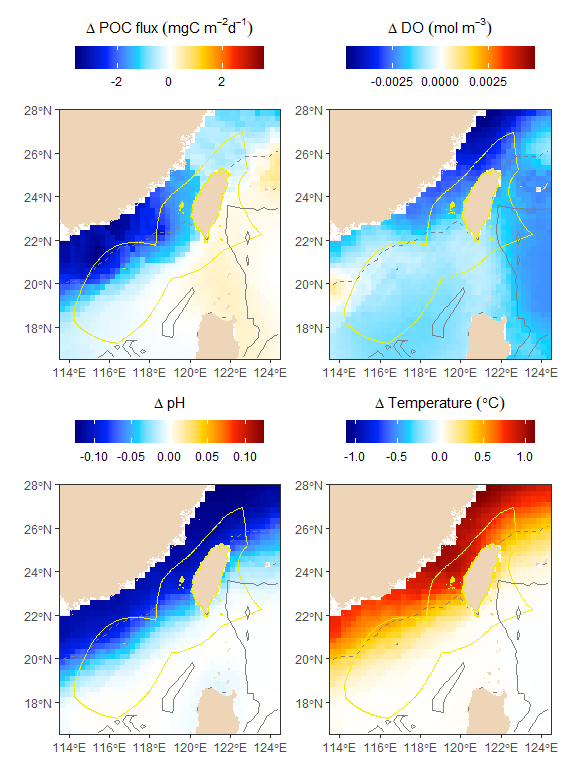
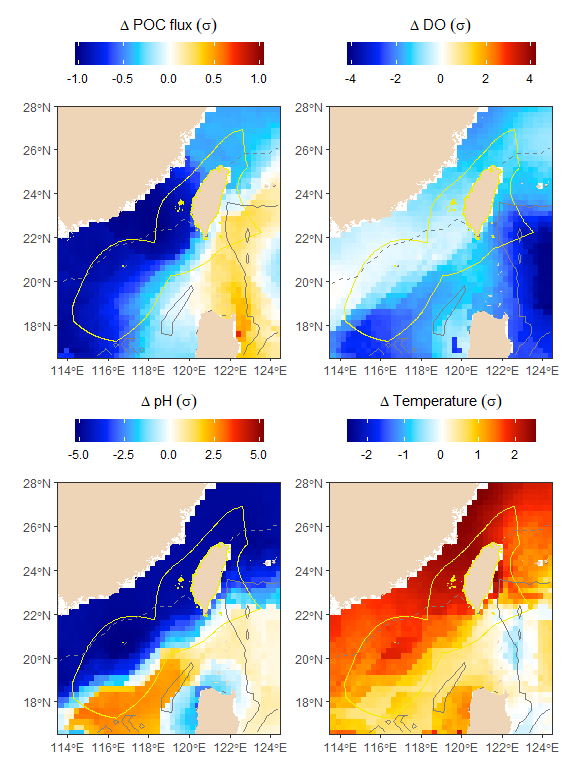
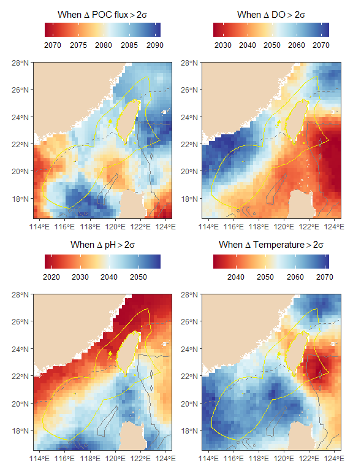

Display seafloor climate change data
================
Chih-Lin Wei
2024-09-13

``` r
library(TaiwanSSP585)
```

# Sealfoor climate change dataset

This data package contains ensemble model averages of CMIP6 historical
and future climate change projections for the seafloor within Taiwan’s
Exclusive Economic Zone (EEZ). Yearly means were calculated from the
outputs of five climate models: GFDL-ESM4, IPSL-CM6A-LR, MPI-ESM1-2-LR,
CNRM-ESM2-1, and NorESM2-MM as part of the Coupled Models
Intercomparison Project Phase 6 (CMIP6). From each model output, we
extracted various parameters such as downward flux of particle organic
carbon at 100-m depth (epc100), dissolved oxygen concentration (o2), pH
value (ph), potential temperature (thetao), aragonite concentration
(arag), calcite concentration (calc), mole concentration of carbonate
expressed as carbon in sea water (co3), carbonate ion concentration for
seawater in equilibrium with pure aragonite (co3satarag), and carbonate
ion concentration for seawater in equilibrium with pure calcite
(aragsat) for the historical scenario from 1950 to 2014 and Shared
Socioeconomic Pathways (SSPs) until 2100.

Some parameters were derived from the model outputs as well. For
instance, the export flux of particulate organic carbon (POC) at the
seafloor was derived from export production at 100 meters depth (epc100)
using the Martin curve [(Martin et al.,
1987)](https://www.sciencedirect.com/science/article/pii/0198014987900860).
The equation for the export POC flux is given
by:$Flux = epc100*(depth/export\:depth)^{-0.858}$. The depth information
is based on the
[etopo2022](https://www.ncei.noaa.gov/products/etopo-global-relief-model)
dataset, and the export depth was fixed at 100 meters. Aragonite
saturation state (aragsat) and calcite saturation state (calcsat) were
calculated as the ratio of carbonate concentration (co3) to the
carbonate concentration in equilibrium with aragonite (co3satarag) and
calcite (co3satcalc), respectively. It’s important to note that
co3satarag and aragsat were only available from the GFDL-ESM4 and
NorESM2-MM models. Here is a table showing the native resolution of each
earth system model in the x, y, and z directions.

| Model         | X   | Y   | Z   |
|---------------|-----|-----|-----|
| GFDL-ESM4     | 360 | 180 | 35  |
| IPSL-CM6A-LR  | 362 | 332 | 75  |
| MPI-ESM1-2-LR | 256 | 220 | 40  |
| CNRM-ESM2-1   | 362 | 294 | 75  |
| NorESM2-MM    | 360 | 385 | 53  |

The yearly outputs of each earth system model were averaged at the
bottommost grids for the time periods 1950 to 2014, 2041 to 2060, and
2081 to 2100. The decadal averages of each parameter were then
interpolated to 0.25 by 0.25-degree grids and computed for ensemble
averages across the five models. All CMIP6 data were downloaded from
[Earth System Grid Federation (ESGF)](https://esgf.llnl.gov/).

We can use this dataset to study the occurrence and impact of climate
change hazards on deep-sea floors. As biological communities adapt to
long-term stability or variability in environmental conditions, we can
establish the historical variability (standard deviation between
1950-2014) as a reference point. Climate change can then be defined as
the difference between future conditions and the historical average.
Climate change hazard, on the other hand, is the ratio of climate change
to historical variability. The time of emergence (ToE) of climate change
is identified as the point when future climate changes exceed twice the
historical variability. This approach allows us to standardize climate
change hazards across different variables, using their historical
variability as a standard unit. For example, a specific variable’s
climate hazard could be 10 or 100 times its historical variability.

# Display the data using custom plot function

# Historical projections

Here we used plotmap function to map the historical projections of
export POC flux (epc), dissolved oxygen concentration (o2), pH values
(ph), and potential temperature (thetao) from 1950 to 2014. Let’s look
at the R documentation to see what’s inside the raster brick data and
plotmap function.

``` r
help("cmip6_1950_2014_av")
help('plotmap')
```

``` r
plotmap(r = cmip6_1950_2014_av %>% subset(1:4), 
         titles = c("POC~flux~(mgC~m^-2*d^-1)", "DO~(mol~m^-3)", "pH", "Temperature~(degree*C)"))
```

<!-- -->

# Historical variability

The historical standard deviation of export POC flux (epc), dissolved
oxygen concentration (o2), pH values (ph), and potential temperature
(thetao) from 1950 to 2014 can also be displayed in the same manner.

``` r
plotmap(r=cmip6_1950_2014_sd %>% subset(1:4), 
         titles = c("POC~flux~(mgC~m^-2*d^-1)", "DO~(mol~m^-3)", "pH", "Temperature~(degree*C)"))
```

<!-- -->

# Future projections

The seafloor projections from 2041 to 2060 can be plotted in the same
way using the ensemble average.

``` r
plotmap(r=cmip6_2041_2060_av %>% subset(1:4), 
         titles = c("POC~flux~(mgC~m^-2*d^-1)", "DO~(mol~m^-3)", "pH", "Temperature~(degree*C)"))
```

<!-- -->

# Climate changes between future and historical projections

We then map the climate changes as the the difference between 1950 and
2014 and 2041 to 2060. Here, we should modify the color key to visualize
the difference better.

``` r
plotmap(r=cmip6_2041_2060_ch %>% subset(1:4), 
         titles = c("Delta~POC~flux~(mgC~m^-2*d^-1)", "Delta~DO~(mol~m^-3)", "Delta~pH", "Delta~Temperature~(degree*C)"))
```

<!-- -->

# Climate change hazards

The plotmap function can also visually display the ratios between
climate changes and historical standard deviation. The color indicates
the degree of climate change in the unit of historical variability.

``` r
plotmap(r=cmip6_2041_2060_exsd %>% subset(1:4),
         titles = c("Delta~POC~flux~(sigma)", "Delta~DO~(sigma)", "Delta~pH~(sigma)", "Delta~Temperature~(sigma)"))
```

<!-- -->

# Time of emergence of climate changes

We can identify the years when climate changes exceed two times the
historical standard deviation (or the year when the value of climate
change hazards \> 2). We use two times the standard deviation because in
a roughly normal data set, values within one standard deviation of the
mean make up about 68% of the set, while values within two standard
deviations make up about 95%.

``` r
plotmap(r=cmip6_extoe_constant %>% subset(1:4), 
         titles=c("When~Delta~POC~flux>2*sigma", "When~Delta~DO>2*sigma", "When~Delta~pH>2*sigma", "When~Delta~Temperature>2*sigma"),
         colours = brewer.pal(10, 'RdYlBu'))
```

<!-- -->

We can combine the four panels above to demonstrate the years when
climate changes for export POC flux, dissolved oxygen, pH, and
temperature simultaneously exceed twice the historical variability.

``` r
all <- overlay(subset(cmip6_extoe_constant, 1:4), fun=max)
names(all) <- "cmip6_extoe_constant"
plotmap(r=all, titles="When~climate~change>2*sigma", colours=brewer.pal(10, 'RdYlBu'))
```

<!-- -->

# Cumulative impact of climate change hazards

Another application involves calculating the cumulative impacts of
climate change hazards. These hazards are caused by declining export POC
flux, deoxygenation, ocean acidification, and ocean warming, and are
considered to have cumulative negative impacts. On the contrary,
increasing export POC flux, oxygenation, ocean basification, and ocean
cooling can have cumulative positive impacts. Here, we have also created
a function to calculate cumulative negative and positive impacts caused
by climate change hazards.

``` r
cum_imp <- function(r){
  # Negative cumulative impact (exposure to climate change hazards for epc<0, o2<0, ph<0, and thetao>0)
  neg <- addLayer(calc(subset(r, 1:3), fun=function(x){x[x>0]<-NA; return(-x)}),
                    calc(subset(r, 4), fun=function(x){x[x<0]<-NA; return(x)})
                    )%>%overlay(fun=function(x)sum(x, na.rm=T))

  # Positive cumulative impact (exposure to climate change hazards for epc>0, o2>0, ph>0, and thetao<0)
  pos <- addLayer(calc(subset(r, 1:3), fun=function(x){x[x<0]<-NA; return(x)}),
                    calc(subset(r, 4), fun=function(x){x[x>0]<-NA; return(-x)})
                    )%>%overlay(fun=function(x)sum(x, na.rm=T))
  
  out <- addLayer(neg, pos)
  names(out) <- c("Negative", "Positive")
  out <- mask(out, etopo2022)
  return(out)
}
```

``` r
plotmap(r=cmip6_2041_2060_exsd %>% cum_imp,
         titles=c("Cumulative~negative~impact~(sigma)", "Cumulative~positivce~impact~(sigma)")
         )
```

<!-- -->

# Climate velocity

An essential factor for species’ survival is how quickly they need to
move to adjust to current environmental conditions and keep up with
climate changes. Local climate velocity can be calculated by measuring
the rate of change of a specific variable (like temperature) over time
and dividing it by the corresponding spatial gradient of that variable
within a 3x3 area. Areas with low local climate velocities may be good
candidates for protection, as they could act as climatic refuges and are
often associated with high levels of endemic species. It’s important to
note that in deep seafloor environments, like the abyssal plain, the
spatial gradient may be small, resulting in high climate velocities. Our
example displays the average seafloor gradient-based climate velocity
magnitudes from 2041 to 2060.

``` r
plotmap(r=cmip6_2041_2060_voccMeg %>% subset(1:4), 
         titles = c("POC~flux~(km~yr^-1)", "DO~(km~yr^-1)", "pH~(km~yr^-1)", "Temperature~(km~yr^-1)"))
```

<!-- -->

# Cumulative impact based on climate velocity

We can calculate the overall negative impact of climate velocity by
considering the impacts of decreasing food supply, deoxygenation,
acidification, and warming, as well as the positive impact of increasing
food supply, oxygen levels, ocean basification, and cooling. Conversely,
the increase in export POC flux, oxygen levels, ocean basification, and
ocean cooling can be considered cumulative positive impacts.

``` r
plotmap(r=cmip6_2041_2060_voccMeg %>% cum_imp, 
         titles=c("Cumul.~negative~impact~(km~yr^-1)", "Cumul.~positivce~impact~(km~yr^-1)"))
```

<!-- -->

# Excercises

- Display the average seafloor climate projections of export POC flux
  (epc), dissolved oxygen concentration (o2), pH values (ph), and
  potential temperature (thetao) from 2081 to 2100.

- Display the average seafloor climate changes of export POC flux (epc),
  dissolved oxygen concentration (o2), pH values (ph), and potential
  temperature (thetao) between 1950 to 2014 and 2081 to 2100.

- Display the average climate change hazards of export POC flux (epc),
  dissolved oxygen concentration (o2), pH values (ph), and potential
  temperature (thetao) from 2081 to 2100.

- Display the cumulative impacts based on climate change hazards (or
  impacts) of export POC flux (epc), dissolved oxygen concentration
  (o2), pH values (ph), and potential temperature (thetao) from 2081 to
  2100.

- Display the average seafloor gradient-based climate velocity
  magnitudes from 2081 to 2100.

- Display the cumulative impacts based climate velocity magnitudes of
  export POC flux (epc), dissolved oxygen concentration (o2), pH values
  (ph), and potential temperature (thetao) from 2081 to 2100.
